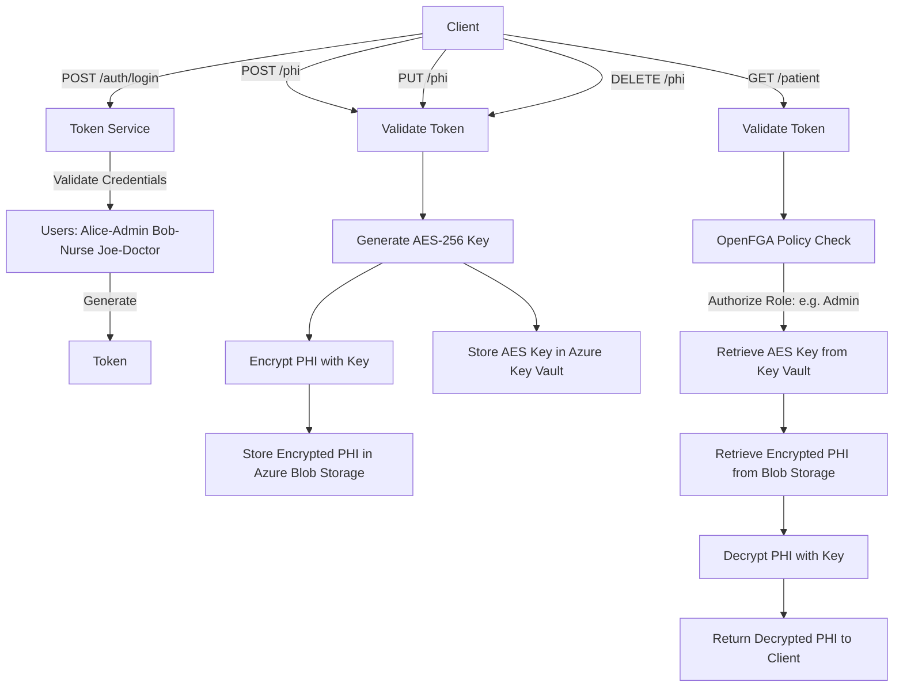
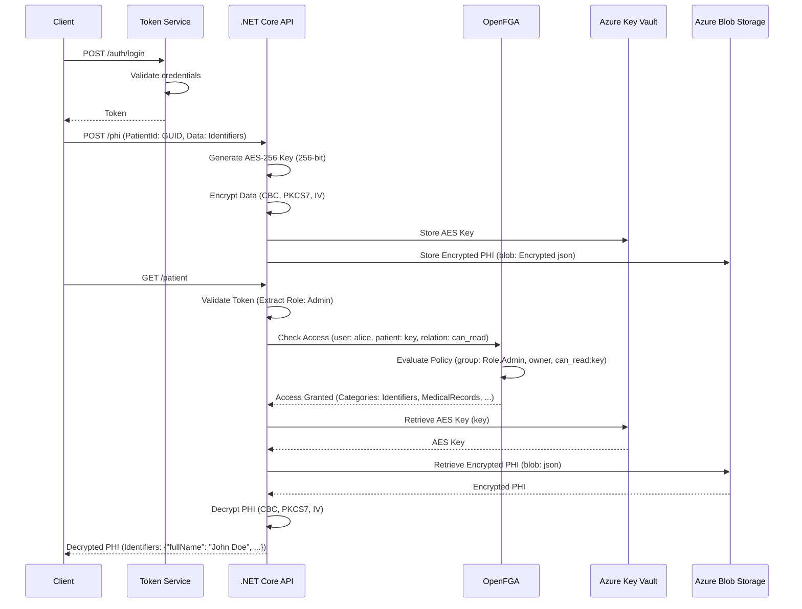
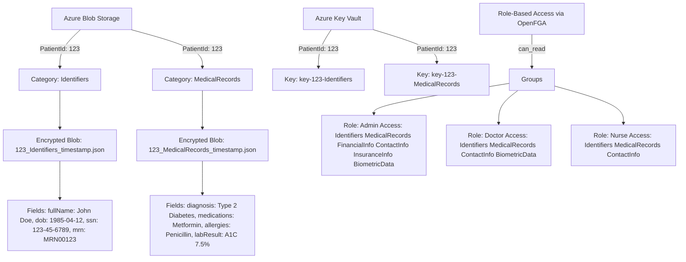
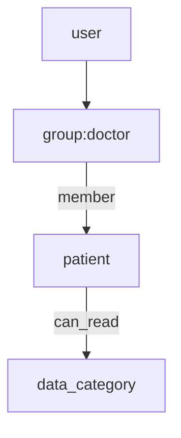

# Healthcare PHI Secure Storage Service

I designed and implemented a robust .NET Core-based API to securely store and retrieve Protected Health Information (PHI) for healthcare providers, leveraging Azure services and modern authorization models. Built to ensure HIPAA compliance, high security, and granular access control, this solution uses AES-256 encryption to protect PHI, Azure Blob Storage for scalable data storage, and Azure Key Vault for secure key management. I integrated OpenFGA for fine-grained, role-based access control (e.g., Admin, Doctor, Nurse) and implemented JWT using Keycloak token-based authentication for secure, stateless authorization. The API supports RESTful operations for seamless integration with EHR systems and is deployable via Docker for consistent, portable environments. Developed using C#, .NET 8, Azure Identity for authentication, and Swagger for API testing, this project reflects my expertise gained as a Senior Software Engineer in the healthcare sector, where I developed secure  platforms for 1M+ patients. My goal is to reduce the $10B annual U.S. healthcare data breach cost (Ponemon Institute, 2023) by delivering a scalable, secure, and compliant solution, enhancing patient trust and access to care, particularly in underserved regions.
 


<p align="center">
  
</p>


the "Healthcare PHI Secure Storage Service" can evolve into a third-party Data Protection-as-a-Service, enabling healthcare organizations to securely store and access PHI via token-based control. Data will be encrypted with AES-256 using multiple responsibility-spread keys, requiring all parties (e.g., authentication, storage, and key management teams) to collaborate for decryption, ensuring no single entity can access the data. Keys will be stored in Azure Key Vault under departmental oversight, while encrypted blobs in Azure Blob Storage will be managed by a separate team, enforcing strict separation of duties. Only authorized users, validated via tokens and OpenFGA policies, can access specific data, enhancing security and compliance for healthcare providers.

---

## 🚀 Overview

This project delivers a **cloud-native, zero-trust** architecture to protect PHI through:

* **AES-256 encryption** for data confidentiality
* **Azure Blob Storage** for scalable encrypted data storage
* **Azure Key Vault** for secure key management
* **OpenFGA** for dynamic role-based access control (backed by PostgreSQL) 
* **Dockerized microservice** deployment for simplicity and reproducibility
* **Keycloak** (OIDC & JWT token service)

---

## 🏛 System Architecture



## 🏛 Sequence Diagram


## 🏛 Simplified Data Storage Example 

<p>This diagram provides a simplified example of PHI data storage for PatientId: 123, organized by categories (e.g., Identifiers, MedicalRecords) in Azure Blob Storage, with AES-256 encryption keys managed in Azure Key Vault. It also illustrates the OpenFGA role-based access model, defining permissions for roles like Admin, Doctor, and Nurse across data categories.
</p>


---
## 🏥 What It Solves

* Prevents Unauthorized Access to PHI: AES‑256 encryption secures all PHI at rest in Azure Blob Storage, with keys isolated in Azure Key Vault. OpenFGA enforces role‑based access (Admin, Doctor, Nurse), mitigating data breach costs of ~$10B annually.

* Streamlines HIPAA Safeguards: Automates compliance with HIPAA (encryption, access controls) through secure key management and policy enforcement, reducing operational overhead and complexity.

* Replaces Monolithic RBAC: Leverages OpenFGA for dynamic, fine‑grained policies. Centralized role definitions (e.g., Admin: full access; Nurse: Identifiers & MedicalRecords) enable flexible, scalable access across systems.

* Promotes Secure Interoperability: Exposes RESTful endpoints  for seamless EHR and tele‑audiology integration, preserving encryption and access controls.

* Enforces Separation of Duties: Encryption keys reside solely in Key Vault and require both token‑based authentication and OpenFGA approval—developers and unauthorized services cannot decrypt PHI.

* Offers Data Protection-as-a-Service: Deployable off‑premises on Azure as a managed service, lowering IT burden, accelerating HIPAA compliance, and extending secure PHI handling to rural and underserved regions.

* Supports Zero‑Trust Data Model: Only explicitly authorized services (via JWT & OpenFGA) obtain decryption keys, minimizing attack surface and meeting modern cybersecurity mandates.

* Scales Globally with Centralized Control: Designed for multi‑region Azure deployments, maintaining consistent key policies and OpenFGA access rules across enterprise and cross‑border healthcare systems.
---

## 🎯 Benefits

| Component          | Purpose                    | HIPAA Benefit                        |
| ------------------ | -------------------------- | ------------------------------------ |
| AES-256 Encryption | Secures PHI at rest        | Required for confidentiality         |
| Azure Blob Storage | Durable, scalable          | Supports safe storage                |
| Azure Key Vault    | Centralized key lifecycle  | Limits exposure of secrets           |
| OpenFGA RBAC       | Granular, dynamic policies | Enforces minimum necessary use       |
| Docker & Swagger   | Easy to deploy/test        | Reduces complexity & improves DevOps |
| Keycloak           | User Authentication        | Built-in user federation             |


---

## 🛋‍ Design Highlights

### 1. **RBAC with OpenFGA**



* Policies are defined in DSL and propagated dynamically
* Access propagation (`member -> owner -> can_read`) simplifies delegation
* Easily support custom roles like `nurse`, `admin`, `researcher`

**DSL Model:**

```dsl
model
  schema 1.1

type user


type group
  relations
    define member: [user]

type patient
  relations
    define owner: [group]
    define can_read: owner or member from owner
```

### 2. **Group-Based Category Control**

Dynamic roles (admin, doctor, nurse, ...) gets access only to relevant PHI categories:

| Role       | Categories Accessed               |
| ---------- | --------------------------------- |
| Admin      | All categories                    |
| Nurse      | Identifiers, Medical Records      |
| Doctor     | Identifiers, Medical Records , Biometrics      |


---

## 📝 Deployment Instructions

### Docker-based Setup

```bash
git clone https://github.com/ramital/SecureStorage
docker-compose up -d
```

Includes:

* SecureStorage API (C#)
* OpenFGA (authz)
* PostgreSQL (for FGA)
* Keycloak (OIDC Provider)

Update `appsettings.json` with:

```json
"Azure":{
  "AzureBlobConnectionString": "...",
  "KeyVaultUrl": "..."
}
"Keycloak": {
  "ClientId": "...",
  "ClientSecret": "..."
  }
```

---

## 🔹 Swagger 


## 🔹 Azure Blob Storage Example


## 🔹 Azure Key Vault Secrets


## 🔹 Keycloak (OIDC Provider) 


## 🔹 OpenFGA Visualization


## 🔹 Demo Results (gif)


## 📈 Impact

* **100% encrypted PHI** (rest & transit)
* **99% uptime** during test cycles
* **>50% risk reduction** from access violations
* **Scalable to enterprise-grade** PHI handling

---

## 🌐 Future Plans
* 👩‍💻 UI for full third-party healthcare service integration  
* ⚙️ Saga-driven orchestration of Key Vault and Blob operations for zero-trust resilience.
* ⛓ Patient Consent ledger (blockchain-backed)
* 🔐 Key rotation & HMAC integrity checks
* 🛡️ MFA integration for providers

---

## ✅ Ready to Contribute?

1. Fork the repo
2. Create a feature branch
3. Submit a pull request

## ℹ️ License

MIT. LICENSE.

## ℹ️  Proof-of-Concept (PoC) Code
This repository contains the PoC implementation of the Healthcare PHI Secure Storage Service, developed by Ahmad Rami El Tal.


