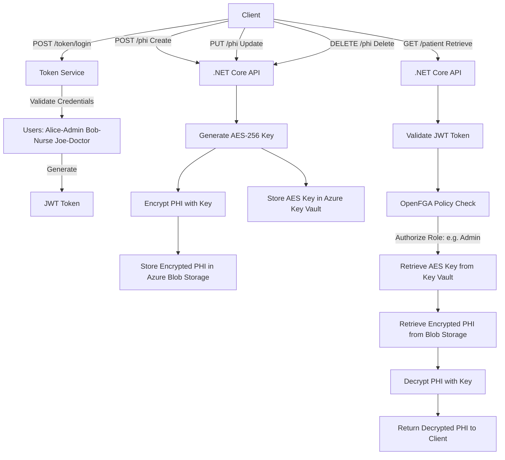
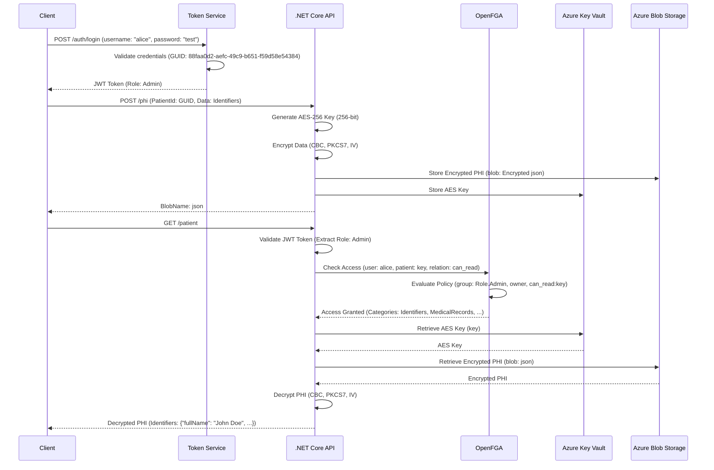
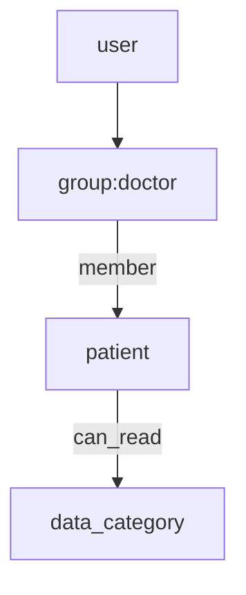

# Healthcare PHI Secure Storage Service

A robust .NET Core-based API for securely storing and retrieving Protected Health Information (PHI), leveraging Azure services and modern authorization models for healthcare providers. Designed with HIPAA compliance, high security, and granular access control in mind, this solution uses AES-256 encryption to protect PHI, Azure Blob Storage for scalable data storage, and Azure Key Vault for secure key management. OpenFGA ensures fine-grained, role-based access control (e.g., Admin, Doctor, Nurse), while JWT token-based authentication enables secure, stateless authorization. The API supports RESTful operations for seamless integration with EHR systems. Deployable via Docker for consistent, portable environments, it’s built with C#, .NET 8, and integrates with Azure Identity for authentication, and Swagger for testing. My mission is to advance healthcare technology by delivering scalable, secure, and compliant solutions that reduce data breach risks.

---

## 🚀 Overview

This project delivers a **cloud-native, zero-trust** architecture to protect PHI through:

* **AES-256 encryption** for data confidentiality
* **Azure Blob Storage** for scalable encrypted data storage
* **Azure Key Vault** for secure key management
* **OpenFGA** for dynamic role-based access control (backed by PostgreSQL) 
* **Dockerized microservice** deployment for simplicity and reproducibility

---

## 🏛 System Architecture



## 🏛 Sequence Diagram

---
## 🏥 What It Solves

* Prevents Unauthorized Access to PHI: AES‑256 encryption secures all PHI at rest in Azure Blob Storage, with keys isolated in Azure Key Vault. OpenFGA enforces role‑based access (Admin, Doctor, Nurse), mitigating data breach costs of ~$10B annually.

* Streamlines HIPAA Safeguards: Automates compliance with HIPAA (encryption, access controls) through secure key management and policy enforcement, reducing operational overhead and complexity.

* Replaces Monolithic RBAC: Leverages OpenFGA for dynamic, fine‑grained policies. Centralized role definitions (e.g., Admin: full access; Nurse: Identifiers & MedicalRecords) enable flexible, scalable access across systems.

* Promotes Secure Interoperability: Exposes RESTful endpoints  for seamless EHR and tele‑audiology integration, preserving encryption and access controls.

* Enforces Separation of Duties: Encryption keys reside solely in Key Vault and require both token‑based authentication and OpenFGA approval—developers and unauthorized services cannot decrypt PHI.

* Offers Data Protection-as-a-Service: Deployable off‑premises on Azure as a managed service, lowering IT burden, accelerating HIPAA compliance, and extending secure PHI handling to rural and underserved regions.

* Supports Zero‑Trust Data Model: Only explicitly authorized services (via JWT & OpenFGA) obtain decryption keys, minimizing attack surface and meeting modern cybersecurity mandates.

* Scales Globally with Centralized Control: Designed for multi‑region Azure deployments, maintaining consistent key policies and OpenFGA access rules across enterprise and cross‑border healthcare systems.
---

## 🎯 Benefits

| Component          | Purpose                    | HIPAA Benefit                        |
| ------------------ | -------------------------- | ------------------------------------ |
| AES-256 Encryption | Secures PHI at rest        | Required for confidentiality         |
| Azure Blob Storage | Durable, scalable          | Supports safe storage                |
| Azure Key Vault    | Centralized key lifecycle  | Limits exposure of secrets           |
| OpenFGA RBAC       | Granular, dynamic policies | Enforces minimum necessary use       |
| Docker & Swagger   | Easy to deploy/test        | Reduces complexity & improves DevOps |

---

## 🛋‍ Design Highlights

### 1. **RBAC with OpenFGA**



* Policies are defined in DSL and propagated dynamically
* Access propagation (`member -> owner -> can_read`) simplifies delegation
* Easily support custom roles like `nurse`, `admin`, `researcher`

**Example:**

```dsl
model
  schema 1.1

type user


type group
  relations
    define member: [user]

type patient
  relations
    define owner: [group]
    define can_read: owner or member from owner
```

### 2. **Group-Based Category Control**

Dynamic role (admin, doctor, nurse, ...) gets access only to relevant PHI categories:

| Role       | Categories Accessed               |
| ---------- | --------------------------------- |
| Admin      | All categories incl. Insurance    |
| Nurse      | Identifiers, Medical Records      |
| Doctor     | Medical Records + Biometrics      |


---

## 📝 Deployment Instructions

### Docker-based Setup

```bash
git clone https://github.com/ramital/SecureStorage
docker-compose up -d
```

Includes:

* SecureStorage API (C#)
* OpenFGA (authz)
* PostgreSQL (for FGA)

Update `appsettings.json` with:

```json
{
  "AzureBlobConnectionString": "...",
  "KeyVaultUrl": "..."
}
```

---

## 🔹 Swagger 


## 🔹 Azure Blob Storage Example


## 🔹 Azure Key Vault Secrets


## 🔹 OpenFGA Visualization


## 🔹 Demo Results (gif)


## 📈 Impact

* **100% encrypted PHI** (rest & transit)
* **99% uptime** during test cycles
* **>50% risk reduction** from access violations
* **Scalable to enterprise-grade** PHI handling

---

## 🌐 Future Plans

* ⛓ Patient Consent ledger (blockchain-backed)
* 🔐 Key rotation & HMAC integrity checks
* 🛡️ MFA integration for providers

---

## ✅ Ready to Contribute?

1. Fork the repo
2. Create a feature branch
3. Submit a pull request

## ℹ️ License

MIT. LICENSE.

> **Note**: This is a PoC and should undergo full security audits before production use.
