# Design Overview


A .NET 8-based API that provides secure, compliant storage and retrieval of Protected Health Information (PHI) and patient consent data. The architecture leverages AES-256 encryption, Azure Blob Storage for scalable storage, and Azure Key Vault for centralized key management. Fine-grained, role-based access control is enforced via OpenFGA, while authentication and authorization are managed through Keycloak and JWT tokens. Consent management APIs allow patients to control access to their data, with all actions fully auditable. The API supports RESTful integration, is containerized with Docker for portability, and utilizes C#, Azure Identity, and Swagger. The platform is designed to reduce data breach risks and costs, increase patient data control, and ensure regulatory compliance, with a forward-looking architecture ready for distributed key management, strict separation of duties, policy-driven access, and immutable, auditable consent records at scale.


## 🚀 Overview

This project delivers a **cloud-native, zero-trust** architecture to protect PHI through:

* **AES-256 encryption** for data confidentiality
* **Azure Blob Storage** for scalable encrypted data storage
* **Azure Confidential Ledger** for immutable, tamper-evident storage for audit trails of patient consent
* **Azure Key Vault** for secure key management
* **OpenFGA** for dynamic role-based access control (backed by PostgreSQL) 
* **Dockerized microservice** deployment for simplicity and reproducibility
* **Keycloak** (OIDC & JWT token service)

---

## 🏛 System Architecture

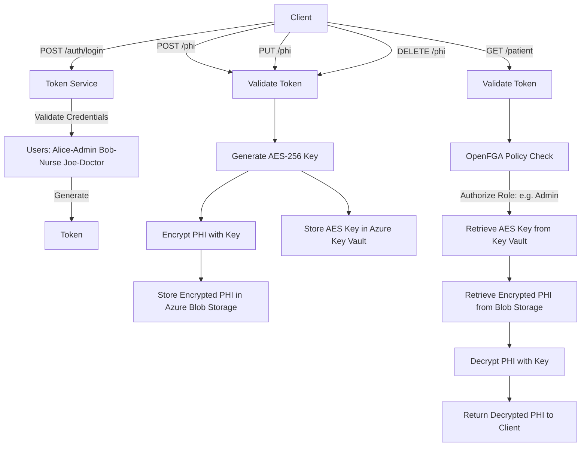

## 🏛 Sequence Diagram
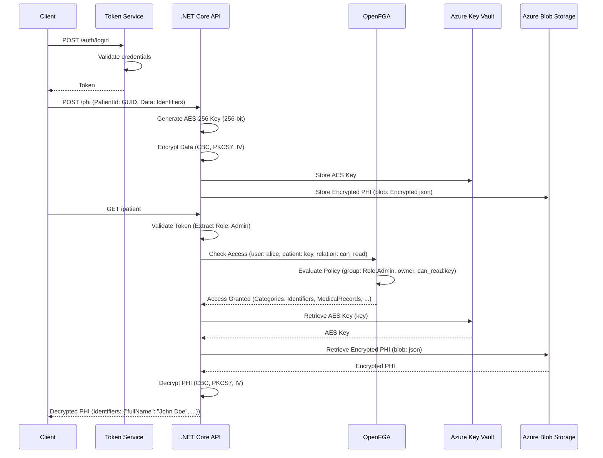

## 🏛 Simplified Data Storage Example 
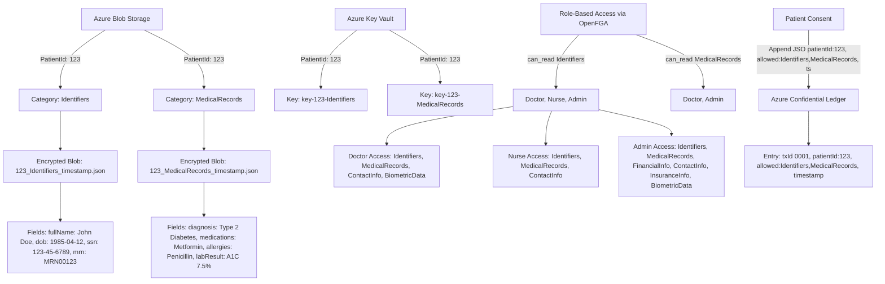
<p>This diagram provides a simplified example of PHI data storage for PatientId: 123, organized by categories (e.g., Identifiers, MedicalRecords) in Azure Blob Storage, with AES-256 encryption keys managed in Azure Key Vault. It also illustrates the OpenFGA role-based access model, defining permissions for roles like Admin, Doctor, and Nurse across data categories.
</p>


---

## 🛋‍ Design Highlights

### 1. **RBAC with OpenFGA**

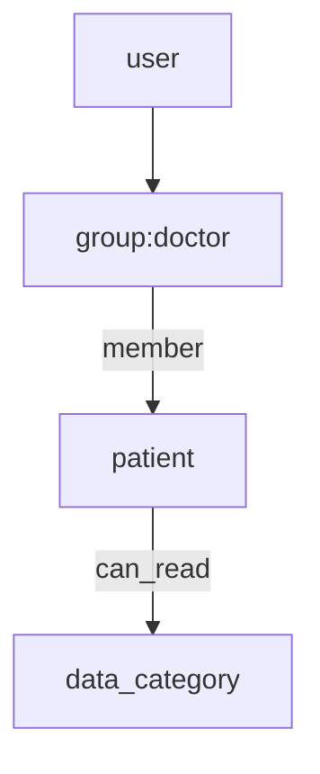

- **Fine-Grained Access**: Control access by role, relationship, or context (e.g., assigned doctor → patient).
- **Relationships inferred (propagated)** through other relationships using defined rules.
- **HIPAA-Aligned**: Enforces least privilege and supports auditability.
- **Policy-as-Code**: Declarative, testable, versioned access rules.


**DSL Model:**

```dsl
model
  schema 1.1

type user


type group
  relations
    define member: [user]

type patient
  relations
    define owner: [group]
    define can_read: owner or member from owner
```

### 2. **Group-Based Category Control**

Dynamic roles (admin, doctor, nurse, ...) gets access only to relevant PHI categories:

| Role       | Categories Accessed               |
| ---------- | --------------------------------- |
| Admin      | All categories                    |
| Nurse      | Identifiers, Medical Records      |
| Doctor     | Identifiers, Medical Records , Biometrics      |


###  3. Blockchain Architecture (Azure Confidential Ledger)

- Uses Azure Confidential Ledger for a tamper-proof audit trail of PHI access|
- Immutable, cryptographically signed transactions for PHI and consent events.
- Managed by Azure for low-latency validation.
- Azure-hosted validator and auditor nodes.


### 4. **AES-256 in Healthcare Data Encryption**

🔐 Stronger Protection Against Breaches
- AES-256 is virtually uncrackable with current technology.
- Many legacy systems still use **AES-128**, **3DES**, or **SHA-1**, which are considered weak by modern standards.
- Ensures protection against legal risks and regulatory fines in the event of data breaches.

🔁 End-to-End Encryption
- Secures **data at rest** (e.g., databases, backups) and **data in transit** (e.g., APIs, HL7).
- Prevents exposure even if systems are compromised internally.

🛡️ Resilient to Future Threats
- Provides robust defense against brute-force attacks.
- Offers stronger resistance than AES-128, including **greater resilience to future quantum-based threats**.


## 🔹 Swagger UI
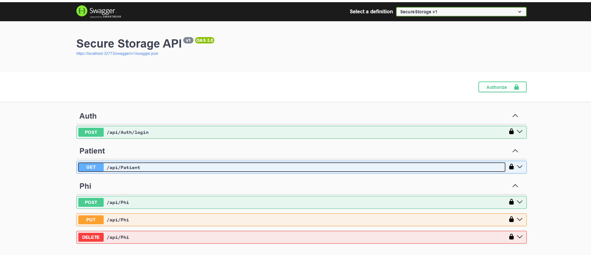

## 🔹 Azure Blob Storage Example
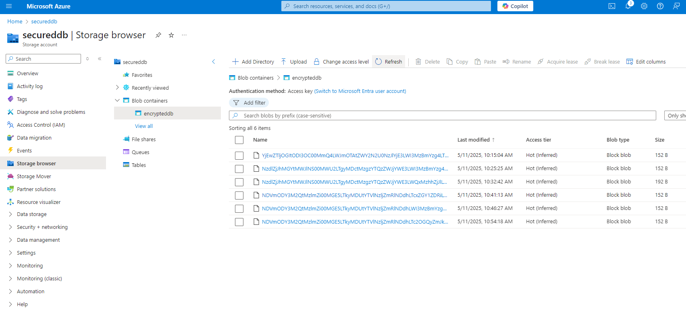

## 🔹 Azure Key Vault Secrets
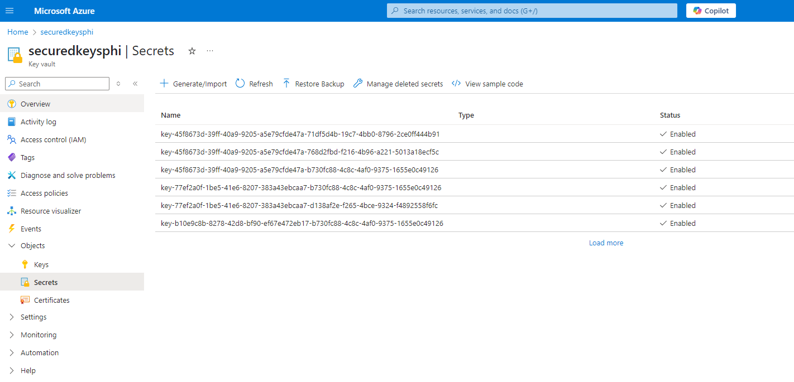

## 🔹 Azure Confidential Ledger
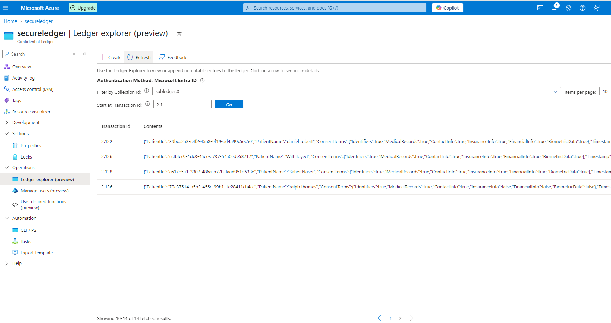


## 🔹 Keycloak (OIDC Provider)
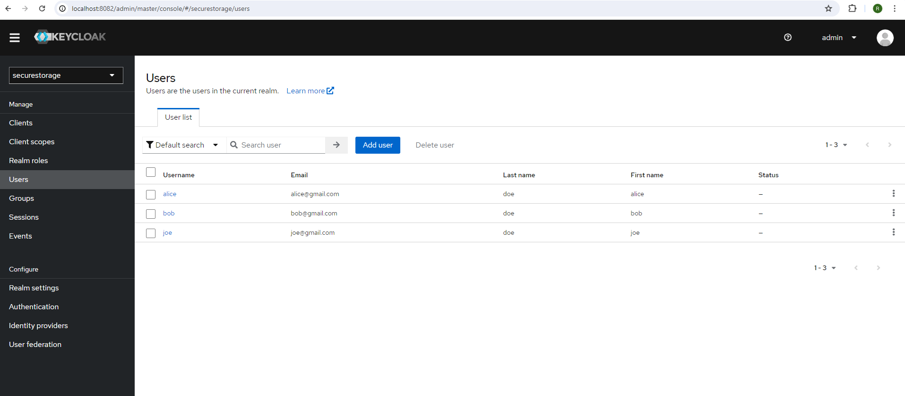

## 🔹 OpenFGA Visualization
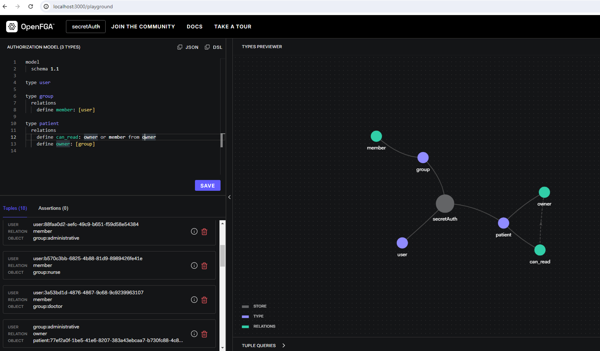

## 🔹 API Demo Results (GIF)
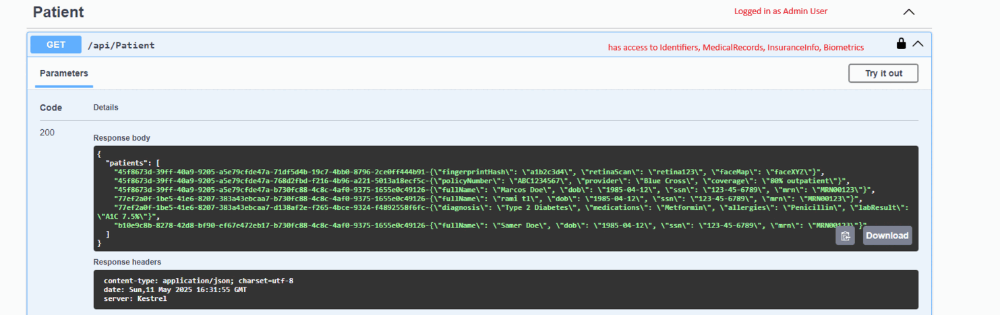

## 🔹 UI Patient List Output for Each Role

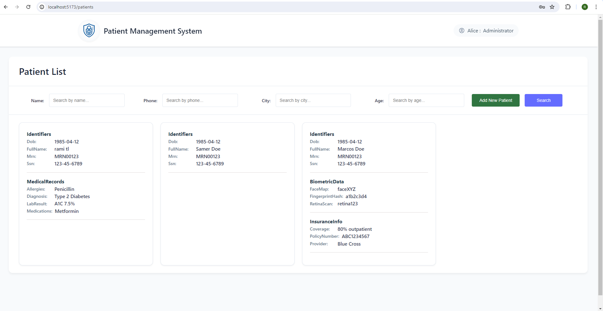  
*Admin role: Full patient data access*

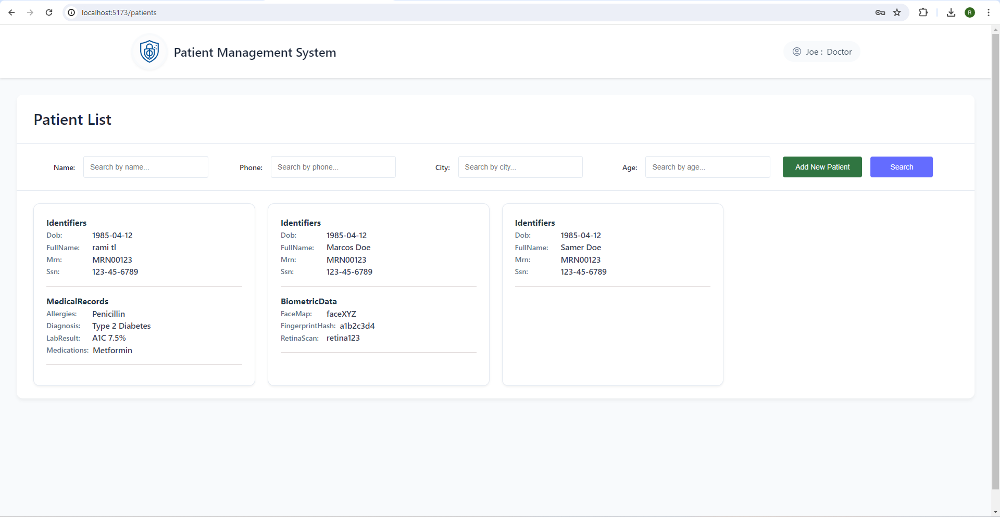  
*Doctor role: Medical + Biometric data access*

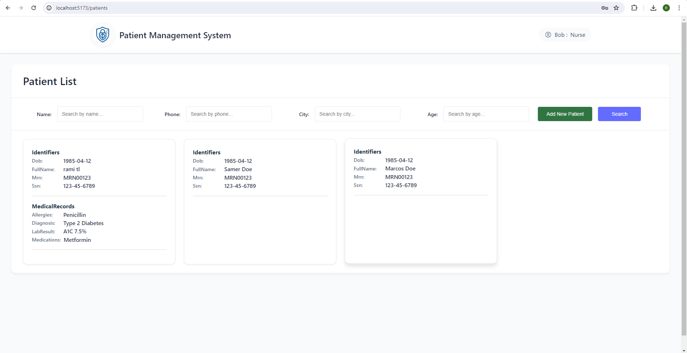  
*Nurse role: Limited patient access*
