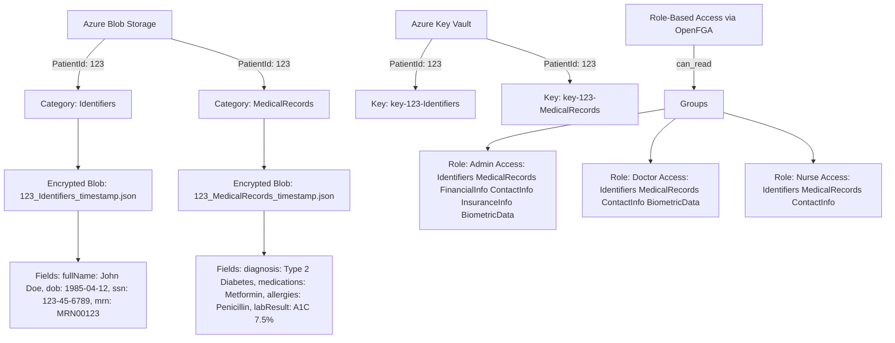

# Healthcare PHI Secure Storage Service

I designed and implemented a robust .NET Core-based API to securely store and retrieve Protected Health Information (PHI) for healthcare providers, leveraging Azure services and modern authorization models. Built to ensure HIPAA compliance, high security, and granular access control, this solution uses AES-256 encryption to protect PHI, Azure Blob Storage for scalable data storage, and Azure Key Vault for secure key management. I integrated OpenFGA for fine-grained, role-based access control (e.g., Admin, Doctor, Nurse) and implemented JWT using Keycloak token-based authentication for secure, stateless authorization. The API supports RESTful operations for seamless integration with EHR systems and is deployable via Docker for consistent, portable environments. Developed using C#, .NET 8, Azure Identity for authentication, and Swagger for API testing, this project reflects my expertise gained as a Senior Software Engineer in the healthcare sector, where I developed secure  platforms for 1M+ patients. My goal is to reduce the $10B annual U.S. healthcare data breach cost (Ponemon Institute, 2023) by delivering a scalable, secure, and compliant solution, enhancing patient trust and access to care, particularly in underserved regions.
 


<p align="center">
  
</p>


the "Healthcare PHI Secure Storage Service" can evolve into a third-party Data Protection-as-a-Service, enabling healthcare organizations to securely store and access PHI via token-based control. Data will be encrypted with AES-256 using multiple responsibility-spread keys, requiring all parties (e.g., authentication, storage, and key management teams) to collaborate for decryption, ensuring no single entity can access the data. Keys will be stored in Azure Key Vault under departmental oversight, while encrypted blobs in Azure Blob Storage will be managed by a separate team, enforcing strict separation of duties. Only authorized users, validated via tokens and OpenFGA policies, can access specific data, enhancing security and compliance for healthcare providers.

---

## 🚀 Overview

This project delivers a **cloud-native, zero-trust** architecture to protect PHI through:

* **AES-256 encryption** for data confidentiality
* **Azure Blob Storage** for scalable encrypted data storage
* **Azure Key Vault** for secure key management
* **OpenFGA** for dynamic role-based access control (backed by PostgreSQL) 
* **Dockerized microservice** deployment for simplicity and reproducibility
* **Keycloak** (OIDC & JWT token service)

---

## 🏛 System Architecture


## 🏛 Sequence Diagram


## 🏛 Simplified Data Storage Example 

<p>This diagram provides a simplified example of PHI data storage for PatientId: 123, organized by categories (e.g., Identifiers, MedicalRecords) in Azure Blob Storage, with AES-256 encryption keys managed in Azure Key Vault. It also illustrates the OpenFGA role-based access model, defining permissions for roles like Admin, Doctor, and Nurse across data categories.
</p>


---

## 🛋‍ Design Highlights

### 1. **RBAC with OpenFGA**


- **Fine-Grained Access**: Control access by role, relationship, or context (e.g., assigned doctor → patient).
- **Relationships inferred (propagated)** through other relationships using defined rules.
- **HIPAA-Aligned**: Enforces least privilege and supports auditability.
- **Policy-as-Code**: Declarative, testable, versioned access rules.


**DSL Model:**

```dsl
model
  schema 1.1

type user


type group
  relations
    define member: [user]

type patient
  relations
    define owner: [group]
    define can_read: owner or member from owner
```

### 2. **Group-Based Category Control**

Dynamic roles (admin, doctor, nurse, ...) gets access only to relevant PHI categories:

| Role       | Categories Accessed               |
| ---------- | --------------------------------- |
| Admin      | All categories                    |
| Nurse      | Identifiers, Medical Records      |
| Doctor     | Identifiers, Medical Records , Biometrics      |


### 3. **AES-256 in Healthcare Data Encryption**

🔐 Stronger Protection Against Breaches
- AES-256 is virtually uncrackable with current technology.
- Many legacy systems still use **AES-128**, **3DES**, or **SHA-1**, which are considered weak by modern standards.

📋 HIPAA & Regulatory Compliance
- AES-256 meets and exceeds encryption standards required by:
  - **HIPAA**
  - **HITECH**
  - **GDPR**
- Ensures protection against legal risks and regulatory fines in the event of data breaches.

🔁 End-to-End Encryption
- Secures **data at rest** (e.g., databases, backups) and **data in transit** (e.g., APIs, HL7).
- Prevents exposure even if systems are compromised internally.

🛡️ Resilient to Future Threats
- Provides robust defense against brute-force attacks.
- Offers stronger resistance than AES-128, including **greater resilience to future quantum-based threats**.

 🤝 Trust and Reputation
- Demonstrates a commitment to data privacy and modern security standards.
- Builds patient trust and competitive differentiation in the healthcare industry.

⚠️ What Many Healthcare Systems Use Now

-  ❌ Plaintext storage or outdated hashing algorithms like **SHA-1/MD5**.

-  ❌ **AES-128** or **3DES** encryption with weak or missing key management.

-  ❌ Lack of encryption in internal **service-to-service** communication.

-  ❌ Minimal use of **key vaults**, **HSMs**, or automated key rotation mechanisms.


---
## 🔹 Swagger UI


## 🔹 Azure Blob Storage Example


## 🔹 Azure Key Vault Secrets


## 🔹 Keycloak (OIDC Provider)


## 🔹 OpenFGA Visualization


## 🔹 API Demo Results (GIF)


## 🔹 UI Patient List Output for Each Role

  
*Admin role: Full patient data access*

  
*Doctor role: Medical + Biometric data access*

  
*Nurse role: Limited patient access*